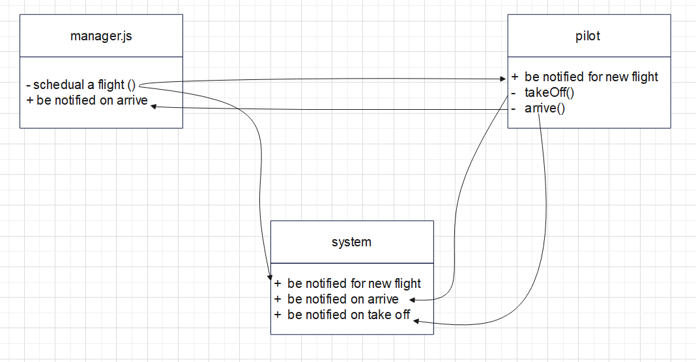

# airline-system

> a control system for an Airline

where you will keep tracking each flight status by contacting the pilot of that flight who in turn will inform the manager and the system when a flight took-off and arrived.  
this system will be created using <del> <b>`Server side events.`<b> <del>

## UML diagram

## Usage

`1- make sure you have node.js istalled` 
`2- clone the porject to your local machine ` 
`3- in the termenal open the project folder` 
`4- to satrt the project, type `npm start `in the terminal` 
